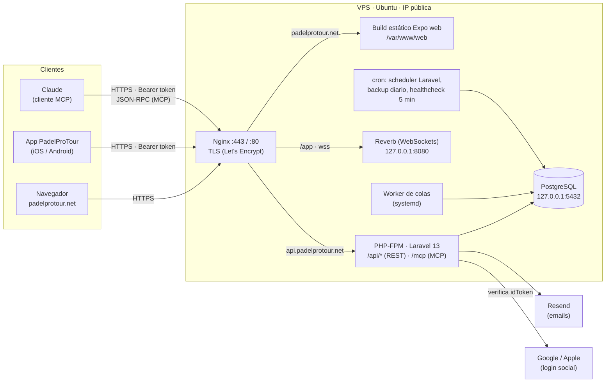
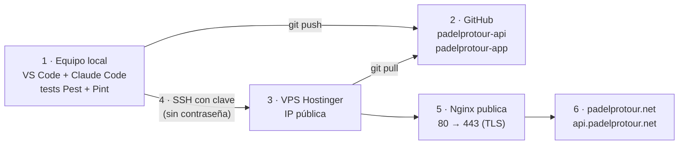

# PadelProTour API

Backend de **PadelProTour**, una plataforma para organizar ligas y torneos de pádel entre amigos: competiciones, categorías, parejas, inscripciones, calendario, resultados, clasificaciones, perfiles de jugador y chat. Sirve a la app ([`padelprotour-app`](https://github.com/rodriiii94/padelprotour-app), Expo para iOS/Android/web) mediante una **API REST** y expone además un **servidor MCP** para que Claude pueda consultar y gestionar tus ligas.

- **Web en producción:** https://padelprotour.net
- **API en producción:** https://api.padelprotour.net (estado: `/up`)
- **Documentación de la API:** [`openapi.yaml`](openapi.yaml) (OpenAPI 3.0, ~76 endpoints)

## Stack

- **PHP 8.5** / **Laravel 13**
- **PostgreSQL** (18 en producción) — datos de la aplicación, cola de trabajos y caché
- **Laravel Sanctum** — autenticación por token Bearer, un token por dispositivo (sin sesión ni cookies)
- **Laravel MCP** — servidor MCP sobre HTTP para Claude
- **Laravel Reverb** — WebSockets para el chat de competición
- **Resend** — emails transaccionales (verificación de cuenta)
- **Sentry** — errores en producción (opcional)
- **Pest** — tests (270+ tests de feature)

## Funcionalidades

- Registro, login (email/contraseña, Google y Apple), verificación de email y eliminación de cuenta.
- Competiciones (torneos y ligas) públicas o **privadas con enlace de invitación**; categorías, parejas e inscripciones (pareja fija o jugador individual con rotación).
- Calendario round-robin automático (ida o ida y vuelta, con bye si el número de parejas es impar) y emparejamientos de jornada.
- **Resultados propuestos por los jugadores** y confirmados por un rival (o solos a las 48 h); clasificación con desempates.
- **Reserva de pista** de cada partido: día/hora, club, pista y enlace al partido de Playtomic.
- Perfiles públicos de jugador (sin email), foto de perfil, estadísticas, logros y seguidores.
- Chat de competición (WebSocket) y chat de partido.
- **Servidor MCP** con 6 herramientas (ver [más abajo](#servidor-mcp-usar-padelprotour-desde-claude)).

## Arquitectura

Todo corre en un único VPS (Hostinger, Ubuntu) detrás de Nginx con HTTPS. Desde Internet solo se publican los puertos **22** (SSH), **80** (redirige a HTTPS) y **443**; PostgreSQL y Reverb escuchan solo en `127.0.0.1`.



**Capas del backend:** rutas (`routes/api.php` para REST, `routes/ai.php` para MCP) → controladores / herramientas MCP (validación de entrada) → **policies** (autorización) → **modelos Eloquent** (reglas de negocio, p. ej. `PadelMatch::proposeResult()`) → PostgreSQL. La API REST y el MCP comparten las mismas policies y reglas de negocio, así que un usuario no puede hacer por MCP nada que no pueda hacer en la app.

## Flujo de desarrollo y despliegue



1. **Equipo local:** se desarrolla en VS Code con Claude Code, contra una base de datos local y datos de ejemplo (`php artisan db:seed`). Antes de subir: `php artisan test` y `vendor/bin/pint`.
2. **GitHub:** dos repositorios, [`padelprotour-api`](https://github.com/rodriiii94/padelprotour-api) (este) y [`padelprotour-app`](https://github.com/rodriiii94/padelprotour-app). Se trabaja en ramas y se integra en `main`, que es lo que se despliega.
3. **Servidor de producción:** VPS con IP pública; dominio `padelprotour.net` con registros DNS `A` para `padelprotour.net`, `www` y `api`.
4. **SSH con par de claves:** se genera un par de claves en el equipo local (`ssh-keygen -t rsa -b 4096`, o `-t ed25519`), la clave pública se añade a `~/.ssh/authorized_keys` del usuario `deploy` en el VPS y se entra sin contraseña: el servidor tiene `PasswordAuthentication no`. La clave privada nunca sale del equipo local. El VPS tiene a su vez su propio par de claves, registrado en GitHub, para hacer `git pull` por SSH.
5. **Publicación de puertos:** Nginx escucha en 80 (solo para redirigir a HTTPS y renovar certificados) y 443; los certificados TLS los emite y renueva Certbot (Let's Encrypt).
6. **Web accesible desde fuera:** https://padelprotour.net (app web) y https://api.padelprotour.net (API y MCP).

Un despliegue de la API es un solo comando: `ssh deploy@<IP> 'cd /var/www/api && bash deploy/deploy.sh'` (hace `git pull`, `composer install`, migraciones, cachés y reinicia servicios). La web se compila en local y se sube con `./deploy/deploy-web.sh <IP>` desde el repo de la app. Instalación desde cero en [`deploy/README.md`](deploy/README.md) y operativa diaria (logs, `.env`, backups, marcha atrás) en [`deploy/DESPLEGAR.md`](deploy/DESPLEGAR.md).

## Seguridad

Medidas aplicadas en el código y en el servidor:

- **Autenticación:** tokens Sanctum por dispositivo; contraseñas con hash bcrypt; el login tarda lo mismo exista o no la cuenta (evita enumerar usuarios por tiempo de respuesta); contraseñas de mínimo 8 caracteres y rechazadas si aparecen en filtraciones conocidas (Have I Been Pwned, por k-anonimato).
- **Rate limiting:** login, registro, login social, verificación de email, invitaciones, borrado de cuenta, subida de fotos, chat y MCP tienen límites propios. El login limita por email + IP y además por email desde cualquier IP, para frenar ataques distribuidos contra una misma cuenta.
- **Autorización:** policies en cada recurso; corregido un **IDOR** por el que las competiciones privadas se podían leer y unirse sin invitación. Ningún endpoint ni herramienta MCP devuelve emails de otros usuarios.
- **Entrada no confiable:** validación en todos los endpoints; las fotos de perfil se recortan y se re-codifican a JPEG de 512 px (corregido un **DoS por agotamiento de memoria** con imágenes gigantes); los enlaces de Playtomic solo se aceptan como `https` de `playtomic.com`/`playtomic.io`; las redes sociales se guardan como usuario, no como URL libre.
- **Fugas de información:** `APP_DEBUG=false` en producción; los 404 no revelan nombres internos de clases.
- **Base de datos con mínimo privilegio:** tres roles de PostgreSQL ([`deploy/db-roles.sql`](deploy/db-roles.sql)): dueño (solo migraciones), `padelprotour_app` (solo lectura/escritura de datos, sin DDL) y `padelprotour_ro` (solo lectura, para backups). PostgreSQL no está expuesto a Internet.
- **Servidor:** SSH solo por clave; servicios como usuario sin privilegios (`deploy`); TLS en todo el tráfico; backup diario de la base de datos con retención de 14 días y healthcheck cada 5 minutos que avisa por email.

## Instalación en local

### Requisitos

- PHP 8.3+
- Composer
- PostgreSQL

### Puesta en marcha

```bash
composer install
cp .env.example .env
php artisan key:generate
```

Edita `.env` con los datos de tu base de datos PostgreSQL (`DB_CONNECTION=pgsql`, `DB_HOST`, `DB_PORT`, `DB_DATABASE`, `DB_USERNAME`, `DB_PASSWORD`) y crea la base de datos si no existe.

```bash
php artisan migrate
php artisan db:seed
```

`db:seed` carga un dataset de ejemplo completo (torneo, liga de pareja fija con calendario y ranking, liga individual con rotación, chat) pensado para desarrollar el frontend contra datos reales desde el primer momento.

**Login de demo:** `demo@padelprotour.test` / `password`

### Levantar la API

```bash
php artisan serve
```

### Levantar el chat en tiempo real

El chat necesita el servidor de Reverb corriendo aparte:

```bash
php artisan reverb:start
```

Sin esto, la API funciona con normalidad pero los mensajes de chat no se emiten por WebSocket (`POST /competitions/{id}/chat-messages` sigue guardando el mensaje igualmente).

## Documentación de la API

La especificación completa (todas las rutas, esquemas de petición/respuesta, autenticación) está en [`openapi.yaml`](openapi.yaml) — formato OpenAPI 3.0, importable directamente en Postman o cualquier visor Swagger/Redoc.

Autenticación: `Authorization: Bearer <token>` en cada petición a una ruta protegida. El token se obtiene en la respuesta de `POST /register` o `POST /login`.

## Servidor MCP (usar PadelProTour desde Claude)

La API expone también un servidor [MCP](https://modelcontextprotocol.io) en `POST /mcp` (transporte HTTP), hecho con `laravel/mcp`. Permite que Claude consulte y actúe sobre tus ligas en tu nombre, con **los mismos permisos que tienes en la app**: se autentica con el mismo token de Sanctum y reutiliza las mismas policies y reglas de negocio que la API REST.

| Herramienta | Qué hace | Tipo |
|---|---|---|
| `list_my_competitions` | Competiciones que organizo o en las que juego, con sus categorías | lectura |
| `get_competition` | Detalle de una competición: organizador, fechas, sede, categorías e inscritos | lectura |
| `get_standings` | Clasificación de una categoría | lectura |
| `list_my_matches` | Mis partidos (próximos, pendientes de validar o jugados) con rivales, sets y reserva de pista | lectura |
| `propose_match_result` | Propone el resultado de un partido en el que juego (un rival lo confirma después) | escritura |
| `update_match_booking` | Apunta día/hora, club, pista y enlace de Playtomic de un partido | escritura |

Ninguna herramienta devuelve emails. Sin token, `/mcp` responde `401`; limitado a 60 peticiones por minuto.

**Conectarlo a Claude Code** (el token es el de `POST /api/login`):

```bash
claude mcp add --transport http padelprotour https://api.padelprotour.net/mcp --header "Authorization: Bearer <token>"
```

En local, cambia la URL por `http://localhost:8000/mcp`. Para inspeccionarlo sin Claude: `npx @modelcontextprotocol/inspector`.

Código: servidor en [`app/Mcp/Servers/PadelProTourServer.php`](app/Mcp/Servers/PadelProTourServer.php), herramientas en [`app/Mcp/Tools`](app/Mcp/Tools), ruta en [`routes/ai.php`](routes/ai.php) y tests en [`tests/Feature/McpServerTest.php`](tests/Feature/McpServerTest.php).

## Tests

```bash
php artisan test --compact
```

Antes de dar por buena cualquier tanda de cambios en PHP:

```bash
vendor/bin/pint --dirty
```

## Notas de arquitectura

- **Sin Form Requests ni API Resources**: los controladores validan inline (`$request->validate()`) y devuelven los modelos Eloquent directamente — es el patrón que ya traía el proyecto y se ha mantenido por consistencia.
- **Autorización por Policies, reutilizadas hacia arriba en la jerarquía**: `Category`, `Phase`, `MatchSet` y `MatchdayPairing` no tienen policy propia — reutilizan `CompetitionPolicy` comprobando la competición de la que cuelgan. `PadelMatch` sí tiene la suya (`PadelMatchPolicy`) porque sus cuatro jugadores tienen permisos propios: ver el partido, su chat y apuntar la reserva de pista.
- **Reglas de negocio en los modelos**: lo que comparten la API REST y el MCP (proponer un resultado, guardar la reserva) vive en `PadelMatch`, no en los controladores; cada punto de entrada solo valida la forma de la entrada y autoriza.
- **Limitación conocida**: el cálculo de ranking en categorías de pareja fija atribuye cada lado de un partido a la `Pair` cuyos jugadores coincidan; si un partido se crea con jugadores que no forman ninguna pareja registrada, ese lado se omite del cálculo (no hay hoy validación en la creación de partidos que lo impida).
